# BGG Models

`bgg_models` is a project for training predictive models using data from boardgamegeek (bgg). 

these models predict how the *bgg community as a whole* will evaluate games (average rating, number of user ratings, complexity). models are trained on game and collection data pulled via [BoardGameGeek's API](https://boardgamegeek.com/wiki/page/BGG_XML_API2) and stored via GoogleCloudStorage

```mermaid
graph LR
    %% Data Sources and Storage
    BGG[BoardGameGeek API] -->|Data Collection| GCS[(Google Cloud Storage)]
    GCS -->|Data Loading| PrepData[Preprocessed Games Data]
    
    %% Data Splitting
    PrepData -->|Time-based Split| DataSets[Training/Validation/Testing Sets]
    
    %% Main Model Components
    DataSets -->|Training| Models[Model Training]
    
    %% Model Types
    Models --> HurdleModel[Hurdle Model<br>Classification]
    Models --> WeightModel[Complexity Model<br>Regression]
    Models --> RatingModels[Rating Models<br>Regression]
    
    %% Evaluation and Deployment
    HurdleModel --> Evaluation[Model Evaluation]
    WeightModel --> Evaluation
    RatingModels --> Evaluation
    
    Evaluation --> Tracking[Performance Tracking]
    Evaluation --> Deployment[Model Deployment]
    
    %% Prediction
    Deployment --> VetiverModels[(Deployed Models<br>in GCS)]
    NewGames[New Games] --> Predictions[Predictions]
    VetiverModels --> Predictions
    
    %% Styling
    classDef storage fill:#f9f,stroke:#333,stroke-width:2px;
    classDef model fill:#bbf,stroke:#333,stroke-width:1px;
    classDef data fill:#dfd,stroke:#333,stroke-width:1px;
    
    class GCS,VetiverModels storage;
    class HurdleModel,WeightModel,RatingModels,Models model;
    class PrepData,DataSets,NewGames,Predictions data;
```

## Project Overview

### Data Management

1. **Data Collection and Storage**:
   - Game data is pulled from BoardGameGeek's API using the `bggUtils` package
   - Data is stored in Google Cloud Storage buckets configured in `config.yml`
   - Authentication to GCS is handled via `authenticate_to_gcs()` function

2. **Data Preprocessing**:
   - Raw game data is processed using `prepare_games()` function
   - Processing includes filtering publishers, handling families, and removing games with missing publication years
   - The `add_hurdle()` function creates a binary target variable for classification

3. **Data Splitting Strategy**:
   - Time-based split using the `create_year_split()` function
   - Training: Games published up to `end_train_year` (set to 2021 in the pipeline)
   - Validation: Games published in the next `valid_years` after `end_train_year` (set to 2 years)
   - Testing: Games published after `end_train_year + valid_years`
   - This approach simulates real-world prediction scenarios where models predict ratings for future games

### Modeling Strategy

1. **Multi-Stage Modeling Approach**:
   - **Hurdle Model**: A classification model using LightGBM that predicts whether a game will reach a minimum threshold of user ratings (25 ratings)
   - **Complexity Model (averageweight)**: A regression model using LightGBM that predicts game complexity on a scale of 1-5
   - **Average Rating Model**: A regression model using glmnet (elastic net) that predicts the average user rating
   - **Users Rated Model**: A regression model using glmnet that predicts the number of user ratings a game will receive

2. **Model Dependencies and Flow**:
   - The averageweight model is trained first and used to impute missing complexity values via `impute_averageweight()`
   - The imputed data is then used to train the average and usersrated models
   - The hurdle model acts as a filter to predict which games will receive enough ratings
   - The average and usersrated models are combined to calculate the bayesaverage (BGG's weighted rating system) via `calculate_bayesaverage()`
   - This multi-model approach handles the complex relationships between game attributes and community reception

3. **Feature Engineering**:
   - Recipes for different model types are defined in `recipe_linear()`, `recipe_trees()`, and `recipe_hurdle()`
   - Features include game attributes (players, playtime, age), categories, mechanics, publishers, designers, etc.
   - Text features from game descriptions are processed (word count, publisher description detection)
   - Spline transformations are applied to capture non-linear relationships

4. **Model Tuning and Hyperparameters**:
   - Models are tuned using grid search with cross-validation
   - LightGBM models tune tree depth, learning rate, and minimum node size
   - Glmnet models tune regularization penalty and mixture (elastic net ratio)
   - Best models are selected based on performance metrics (RMSE, ROC AUC, etc.)

### Evaluation and Deployment

1. **Model Assessment**:
   - Models are evaluated on validation data using functions in `assess.R`
   - Classification metrics include F1, F2, precision, recall, and balanced accuracy
   - Regression metrics include RMSE, MAE, MAPE, R², and concordance correlation coefficient
   - Results are visualized using functions in `visualizations/models.R`

2. **Performance Tracking**:
   - Model performance is tracked over time with metrics stored in CSV files
   - The `write_tracking()` function in `tracking.R` saves metrics with timestamps and user information
   - This enables monitoring of model drift and performance improvements

3. **Model Deployment**:
   - Final models are trained on combined training and validation data
   - Models are deployed using the `vetiver` package via `pin_outcome_model()`
   - Models are stored in Google Cloud Storage with metadata including performance metrics
   - The `targets` package manages the entire pipeline, ensuring reproducibility

### Predictions

1. **Making Predictions**:
   - New games can be processed through the same preprocessing pipeline
   - The `predict_outcomes()` function applies all models in sequence:
     1. Predict complexity with the averageweight model
     2. Apply the hurdle model to determine if the game will get enough ratings
     3. Predict average rating and number of user ratings
     4. Calculate the expected bayesaverage (weighted rating)
   - This provides a comprehensive prediction of how the BGG community will receive a new game

2. **Visualization and Reporting**:
   - Results are visualized using custom plotting functions
   - Quarto is used for generating reports and documentation
   - The project includes functions for creating interactive tables of predictions