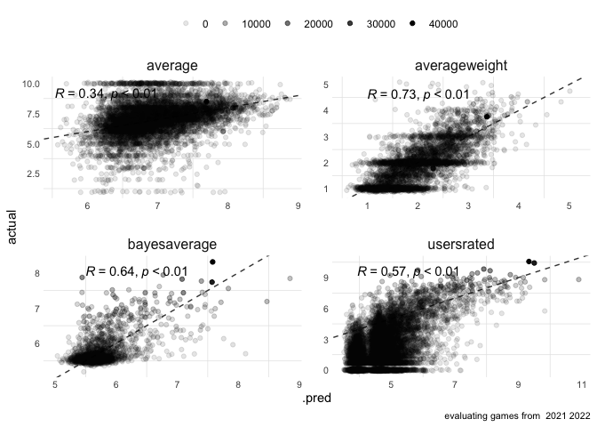

# Model Results

2024-05-23

# pipeline

``` mermaid
graph LR
  style Legend fill:#FFFFFF00,stroke:#000000;
  style Graph fill:#FFFFFF00,stroke:#000000;
  subgraph Legend
    direction LR
    x7420bd9270f8d27d([""Up to date""]):::uptodate --- xa8565c104d8f0705([""Dispatched""]):::dispatched
    xa8565c104d8f0705([""Dispatched""]):::dispatched --- xbf4603d6c2c2ad6b([""Stem""]):::none
  end
  subgraph Graph
    direction LR
    x04d83687468f3fc4(["averageweight_tuned"]):::uptodate --> x0f34a02bd6ed632f(["averageweight_fit"]):::uptodate
    x170105733f313efa(["training_imputed"]):::uptodate --> x8b18f98f2746942f(["usersrated_tuned"]):::uptodate
    x2b7f0716b8751c70(["games_raw"]):::uptodate --> xe73a0f95bb7c669b(["games_prepared"]):::uptodate
    x0f34a02bd6ed632f(["averageweight_fit"]):::uptodate --> x170105733f313efa(["training_imputed"]):::uptodate
    x6a9d509448f9bd3e(["split"]):::uptodate --> x170105733f313efa(["training_imputed"]):::uptodate
    x0f34a02bd6ed632f(["averageweight_fit"]):::uptodate --> x5a0dca7931d71121(["averageweight_final"]):::uptodate
    xe5bd2d3c6fdf29ae(["training_and_validation"]):::uptodate --> x5a0dca7931d71121(["averageweight_final"]):::uptodate
    x32d592eaf8d082e6(["valid_predictions"]):::uptodate --> xc2507955de0caf4e(["valid_metrics"]):::uptodate
    xe5bd2d3c6fdf29ae(["training_and_validation"]):::uptodate --> xd99568a85da9c31b(["usersrated_final"]):::uptodate
    xd6936e852f1fbe47(["usersrated_fit"]):::uptodate --> xd99568a85da9c31b(["usersrated_final"]):::uptodate
    x51e4cab15d71e6a3(["average_final"]):::uptodate --> x09d4ee9c0cdd997f(["test_predictions"]):::uptodate
    x5a0dca7931d71121(["averageweight_final"]):::uptodate --> x09d4ee9c0cdd997f(["test_predictions"]):::uptodate
    x6a9d509448f9bd3e(["split"]):::uptodate --> x09d4ee9c0cdd997f(["test_predictions"]):::uptodate
    xd99568a85da9c31b(["usersrated_final"]):::uptodate --> x09d4ee9c0cdd997f(["test_predictions"]):::uptodate
    x0f34a02bd6ed632f(["averageweight_fit"]):::uptodate --> x60bd72cb3684ce1d(["validation_imputed"]):::uptodate
    x6a9d509448f9bd3e(["split"]):::uptodate --> x60bd72cb3684ce1d(["validation_imputed"]):::uptodate
    xe73a0f95bb7c669b(["games_prepared"]):::uptodate --> x6a9d509448f9bd3e(["split"]):::uptodate
    xe5bd2d3c6fdf29ae(["training_and_validation"]):::uptodate --> x156a6ed4485a6769(["usersrated_vetiver"]):::uptodate
    xd99568a85da9c31b(["usersrated_final"]):::uptodate --> x156a6ed4485a6769(["usersrated_vetiver"]):::uptodate
    x8b18f98f2746942f(["usersrated_tuned"]):::uptodate --> x156a6ed4485a6769(["usersrated_vetiver"]):::uptodate
    xc2507955de0caf4e(["valid_metrics"]):::uptodate --> x156a6ed4485a6769(["usersrated_vetiver"]):::uptodate
    x170105733f313efa(["training_imputed"]):::uptodate --> xe5bd2d3c6fdf29ae(["training_and_validation"]):::uptodate
    x60bd72cb3684ce1d(["validation_imputed"]):::uptodate --> xe5bd2d3c6fdf29ae(["training_and_validation"]):::uptodate
    x170105733f313efa(["training_imputed"]):::uptodate --> xd0ff2216903615b0(["average_tuned"]):::uptodate
    xc0de7cb1ceaaae9a(["average_fit"]):::uptodate --> x51e4cab15d71e6a3(["average_final"]):::uptodate
    xe5bd2d3c6fdf29ae(["training_and_validation"]):::uptodate --> x51e4cab15d71e6a3(["average_final"]):::uptodate
    x45aff652992a023a(["details"]):::uptodate --> x3c2f8ffacaa45076(["reports"]):::dispatched
    xc2507955de0caf4e(["valid_metrics"]):::uptodate --> x3c2f8ffacaa45076(["reports"]):::dispatched
    x32d592eaf8d082e6(["valid_predictions"]):::uptodate --> x3c2f8ffacaa45076(["reports"]):::dispatched
    x51e4cab15d71e6a3(["average_final"]):::uptodate --> x1b61a8b8a8b5e6c2(["average_vetiver"]):::uptodate
    xd0ff2216903615b0(["average_tuned"]):::uptodate --> x1b61a8b8a8b5e6c2(["average_vetiver"]):::uptodate
    xe5bd2d3c6fdf29ae(["training_and_validation"]):::uptodate --> x1b61a8b8a8b5e6c2(["average_vetiver"]):::uptodate
    xc2507955de0caf4e(["valid_metrics"]):::uptodate --> x1b61a8b8a8b5e6c2(["average_vetiver"]):::uptodate
    xd0ff2216903615b0(["average_tuned"]):::uptodate --> xc0de7cb1ceaaae9a(["average_fit"]):::uptodate
    x6a9d509448f9bd3e(["split"]):::uptodate --> x04d83687468f3fc4(["averageweight_tuned"]):::uptodate
    xc0de7cb1ceaaae9a(["average_fit"]):::uptodate --> x32d592eaf8d082e6(["valid_predictions"]):::uptodate
    xd6936e852f1fbe47(["usersrated_fit"]):::uptodate --> x32d592eaf8d082e6(["valid_predictions"]):::uptodate
    x60bd72cb3684ce1d(["validation_imputed"]):::uptodate --> x32d592eaf8d082e6(["valid_predictions"]):::uptodate
    x8b18f98f2746942f(["usersrated_tuned"]):::uptodate --> xd6936e852f1fbe47(["usersrated_fit"]):::uptodate
    xd0ff2216903615b0(["average_tuned"]):::uptodate --> x45aff652992a023a(["details"]):::uptodate
    x04d83687468f3fc4(["averageweight_tuned"]):::uptodate --> x45aff652992a023a(["details"]):::uptodate
    x8b18f98f2746942f(["usersrated_tuned"]):::uptodate --> x45aff652992a023a(["details"]):::uptodate
    x45aff652992a023a(["details"]):::uptodate --> x92c9ab88ae1439d1(["tracking"]):::uptodate
    xc2507955de0caf4e(["valid_metrics"]):::uptodate --> x92c9ab88ae1439d1(["tracking"]):::uptodate
    x5a0dca7931d71121(["averageweight_final"]):::uptodate --> xcbeb0ce109eb5b86(["averageweight_vetiver"]):::uptodate
    x04d83687468f3fc4(["averageweight_tuned"]):::uptodate --> xcbeb0ce109eb5b86(["averageweight_vetiver"]):::uptodate
    xe5bd2d3c6fdf29ae(["training_and_validation"]):::uptodate --> xcbeb0ce109eb5b86(["averageweight_vetiver"]):::uptodate
    xc2507955de0caf4e(["valid_metrics"]):::uptodate --> xcbeb0ce109eb5b86(["averageweight_vetiver"]):::uptodate
  end
  classDef uptodate stroke:#000000,color:#ffffff,fill:#354823;
  classDef dispatched stroke:#000000,color:#000000,fill:#DC863B;
  classDef none stroke:#000000,color:#000000,fill:#94a4ac;
  linkStyle 0 stroke-width:0px;
  linkStyle 1 stroke-width:0px;
```

# workflows

workflow objects

  &#10;  

| name                |                time | seconds |
|:--------------------|--------------------:|--------:|
| average_tuned       | 2024-05-23 13:06:48 | 178.743 |
| averageweight_tuned | 2024-05-23 12:59:27 |  86.476 |
| usersrated_tuned    | 2024-05-23 13:03:39 | 193.233 |
| average_fit         | 2024-05-23 13:09:00 |  49.730 |
| averageweight_fit   | 2024-05-23 12:59:58 |  21.004 |
| usersrated_fit      | 2024-05-23 13:07:56 |  53.211 |

workflow details

  &#10;  

| outcome       | wflow_id | penalty | mixture | .config               |
|:--------------|:---------|--------:|--------:|:----------------------|
| average       | glmnet   |    0.01 |     0.5 | Preprocessor1_Model27 |
| usersrated    | glmnet   |    0.01 |     0.5 | Preprocessor1_Model27 |
| averageweight | glmnet   |    0.01 |     0.5 | Preprocessor1_Model27 |

# metrics

## overall

  &#10;  

| minratings | outcome       |     rmse |     mae |    mape |   rsq |   ccc |
|-----------:|:--------------|---------:|--------:|--------:|------:|------:|
|          0 | average       |    1.303 |   0.923 |  16.481 | 0.113 | 0.204 |
|          0 | averageweight |    0.548 |   0.420 |  24.993 | 0.529 | 0.701 |
|          0 | bayesaverage  |    0.300 |   0.174 |   2.878 | 0.412 | 0.633 |
|          0 | usersrated    |  995.119 | 205.792 |     Inf | 0.163 | 0.401 |
|         25 | average       |    0.688 |   0.506 |   7.625 | 0.277 | 0.458 |
|         25 | averageweight |    0.479 |   0.367 |  20.356 | 0.630 | 0.773 |
|         25 | bayesaverage  |    0.300 |   0.174 |   2.878 | 0.412 | 0.633 |
|         25 | usersrated    | 1889.093 | 468.314 | 165.094 | 0.145 | 0.379 |

## yearpublished

  &#10;  

| minratings | outcome       | yearpublished |     rmse |     mae |    mape |   rsq |   ccc |
|-----------:|:--------------|--------------:|---------:|--------:|--------:|------:|------:|
|          0 | average       |          2021 |    1.325 |   0.937 |  17.152 | 0.114 | 0.203 |
|          0 | averageweight |          2021 |    0.550 |   0.421 |  25.243 | 0.522 | 0.697 |
|          0 | bayesaverage  |          2021 |    0.293 |   0.175 |   2.893 | 0.443 | 0.652 |
|          0 | usersrated    |          2021 |  839.996 | 210.756 |     Inf | 0.369 | 0.528 |
|         25 | average       |          2021 |    0.667 |   0.492 |   7.457 | 0.309 | 0.486 |
|         25 | averageweight |          2021 |    0.483 |   0.372 |  21.398 | 0.620 | 0.768 |
|         25 | bayesaverage  |          2021 |    0.293 |   0.175 |   2.893 | 0.443 | 0.652 |
|         25 | usersrated    |          2021 | 1603.947 | 487.779 | 159.969 | 0.347 | 0.508 |
|          0 | average       |          2022 |    1.279 |   0.908 |  15.805 | 0.106 | 0.198 |
|          0 | averageweight |          2022 |    0.546 |   0.419 |  24.744 | 0.536 | 0.705 |
|          0 | bayesaverage  |          2022 |    0.307 |   0.173 |   2.864 | 0.384 | 0.614 |
|          0 | usersrated    |          2022 | 1130.823 | 200.761 |     Inf | 0.129 | 0.296 |
|         25 | average       |          2022 |    0.708 |   0.521 |   7.789 | 0.240 | 0.423 |
|         25 | averageweight |          2022 |    0.474 |   0.362 |  19.326 | 0.644 | 0.778 |
|         25 | bayesaverage  |          2022 |    0.307 |   0.173 |   2.864 | 0.384 | 0.614 |
|         25 | usersrated    |          2022 | 2130.446 | 449.355 | 170.084 | 0.115 | 0.274 |

# predictions

## validation

what were the top games?

  &#10;  

| rank | game_id | name                                            | yearpublished | .pred_usersrated | .pred_average | .pred_bayesaverage | .pred_averageweight | average | averageweight | bayesaverage | usersrated |
|-----:|--------:|:------------------------------------------------|--------------:|-----------------:|--------------:|-------------------:|--------------------:|--------:|--------------:|-------------:|-----------:|
|    1 |  295770 | Frosthaven                                      |          2022 |           22,500 |          9.00 |               8.71 |                4.21 |    8.87 |          4.35 |         7.85 |      6,307 |
|    2 |  305096 | Endless Winter: Paleoamericans                  |          2022 |           71,000 |          8.45 |               8.37 |                3.35 |    7.77 |          3.29 |         7.22 |      7,552 |
|    3 |  359999 | Agricola 15                                     |          2022 |           19,500 |          8.52 |               8.24 |                3.17 |    7.28 |          3.56 |         5.73 |        315 |
|    4 |  322524 | Bardsung                                        |          2022 |            9,200 |          8.46 |               7.93 |                3.18 |    7.46 |          3.03 |         5.88 |        809 |
|    5 |  325494 | ISS Vanguard                                    |          2022 |           12,000 |          8.12 |               7.74 |                3.08 |    8.65 |          3.65 |         7.14 |      3,034 |
|    6 |  342942 | Ark Nova                                        |          2021 |           11,950 |          7.98 |               7.63 |                3.20 |    8.54 |          3.75 |         8.33 |     40,200 |
|    7 |  310873 | Carnegie                                        |          2022 |            6,750 |          8.24 |               7.62 |                3.40 |    8.04 |          3.82 |         7.51 |      8,403 |
|    8 |  314582 | Amsterdam                                       |          2022 |            9,400 |          8.02 |               7.58 |                2.92 |    7.83 |          3.46 |         6.15 |        809 |
|    9 |  359609 | Arkham Horror: The Card Game (Revised Edition)  |          2021 |           12,500 |          7.89 |               7.57 |                3.60 |    8.65 |          3.64 |         6.97 |      2,050 |
|   10 |  343905 | Boonlake                                        |          2021 |            8,150 |          8.04 |               7.54 |                3.69 |    7.67 |          3.79 |         7.00 |      4,670 |
|   11 |  318184 | Imperium: Classics                              |          2021 |            8,050 |          7.99 |               7.49 |                3.12 |    7.71 |          3.56 |         7.10 |      6,237 |
|   12 |  318182 | Imperium: Legends                               |          2021 |            7,450 |          8.02 |               7.48 |                3.17 |    7.85 |          3.72 |         6.92 |      3,444 |
|   13 |  326945 | Castles of Mad King Ludwig: Collector's Edition |          2022 |            5,900 |          8.14 |               7.47 |                2.50 |    8.35 |          2.47 |         6.52 |      1,188 |
|   14 |  273330 | Bloodborne: The Board Game                      |          2021 |            4,550 |          8.31 |               7.45 |                2.83 |    7.80 |          3.05 |         6.77 |      3,383 |
|   15 |  330038 | Llamaland                                       |          2021 |           15,450 |          7.70 |               7.45 |                2.30 |    7.32 |          2.02 |         6.38 |      1,997 |
|   16 |  255984 | Sleeping Gods                                   |          2021 |            6,900 |          8.01 |               7.44 |                3.29 |    8.24 |          3.25 |         7.75 |     11,135 |
|   17 |  322708 | Descent: Legends of the Dark                    |          2021 |            4,950 |          8.21 |               7.43 |                3.29 |    7.96 |          2.71 |         6.99 |      4,423 |
|   18 |  310100 | Nemesis: Lockdown                               |          2022 |            6,200 |          8.03 |               7.41 |                2.97 |    8.36 |          3.89 |         7.41 |      5,059 |
|   19 |  344277 | Corrosion                                       |          2021 |            9,000 |          7.83 |               7.41 |                2.98 |    7.06 |          3.23 |         6.06 |      1,176 |
|   20 |  295947 | Cascadia                                        |          2021 |           13,650 |          7.68 |               7.40 |                2.28 |    7.96 |          1.83 |         7.77 |     35,252 |
|   21 |  332772 | Revive                                          |          2022 |            5,800 |          8.04 |               7.39 |                3.52 |    8.18 |          3.41 |         7.46 |      5,957 |
|   22 |  327890 | Creature Comforts: Kickstarter Edition          |          2022 |            4,150 |          8.28 |               7.37 |                2.16 |    7.84 |          2.25 |         6.13 |        787 |
|   23 |  362452 | Atiwa                                           |          2022 |            3,750 |          8.37 |               7.37 |                3.14 |    7.51 |          2.72 |         6.51 |      2,168 |
|   24 |  324657 | Core Space: First Born                          |          2021 |            3,500 |          8.41 |               7.36 |                3.24 |    8.33 |          3.73 |         5.73 |        234 |
|   25 |  350316 | Wayfarers of the South Tigris                   |          2022 |            6,050 |          7.94 |               7.33 |                2.96 |    7.84 |          3.84 |         7.04 |      4,082 |

